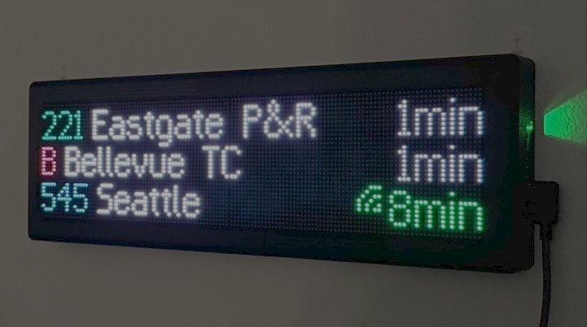
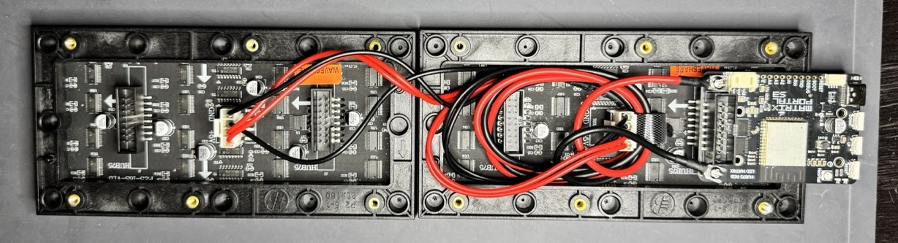
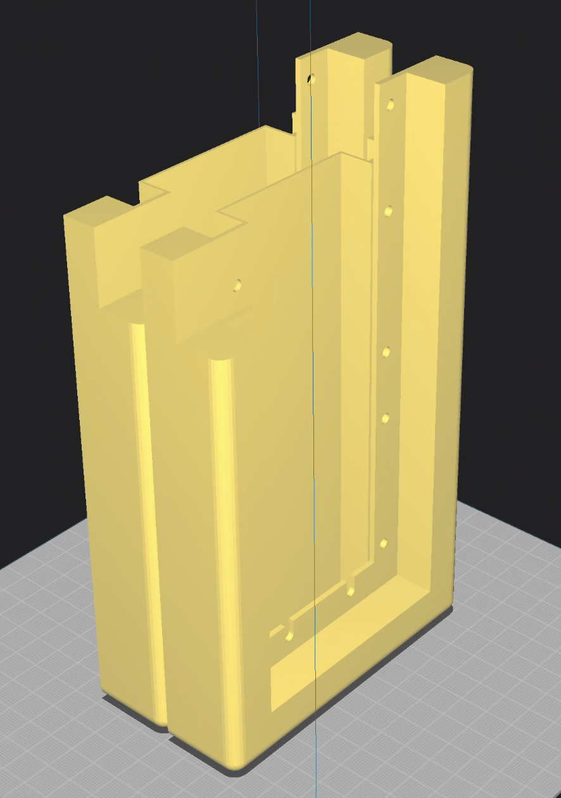
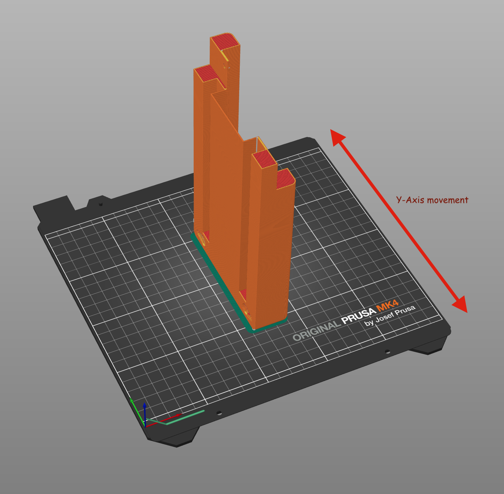
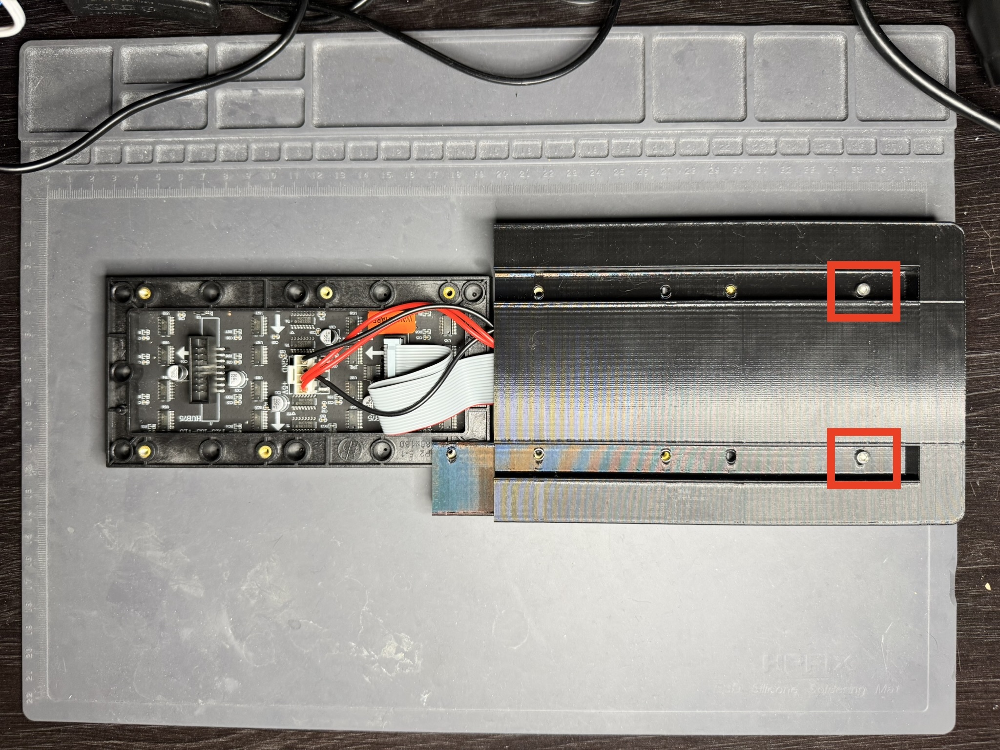
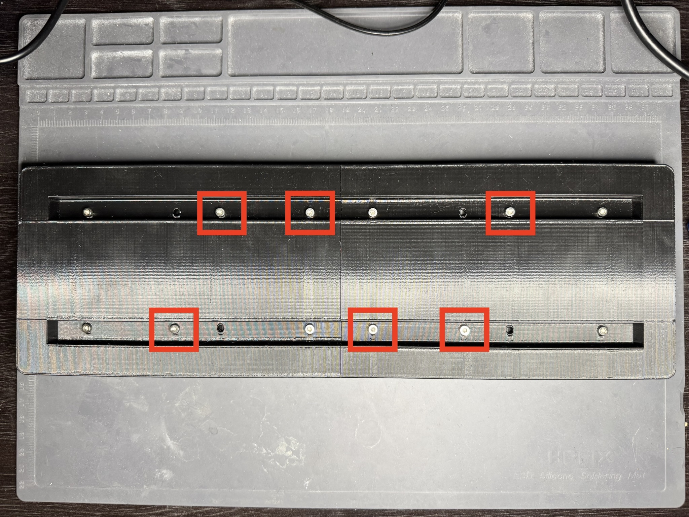

# Transit Tracker Build Guide

This guide will walk you through building an ESP32-S3-based countdown clock which shows the real-time arrival times for any public transit route of your choice. By the end of this guide, you will have something that looks like this:

While we will be using this display as a countdown clock, you could customize it with your own firmware and display anything you'd like; however, that's out of scope for this guide.

- [Materials](#materials)
- [Instructions](#instructions)
  - [Part 1: Wire the displays](#part-1-wire-the-displays)
  - [Part 2: Flash the firmware](#part-2-flash-the-firmware)
  - [Part 3: 3D print the frame](#part-3-3d-print-the-frame)
    - [Recommendations](#recommendations)
      - [Material](#material)
      - [Orientation](#orientation)
      - [Slicer settings](#slicer-settings)
  - [Part 4: Assemble the frame](#part-4-assemble-the-frame)
  - [You're done!](#youre-done)
- [Connecting to Home Assistant](#connecting-to-home-assistant)
- [Advanced Customization](#advanced-customization)

## Materials

- 1 × [Adafruit Matrix Portal S3](https://www.adafruit.com/product/5778)
- 2 × [Waveshare RGB-Matrix-P2.5-64x32](https://www.waveshare.com/rgb-matrix-p2.5-64x32.htm)
- 12 × M3x8mm machine screws (you can get these at your local hardware store)
- 1 × USB power supply, at least 5V 3A
- 1 × USB-C cable, preferably right-angle

You will also need a 3D printer with a build volume of at least 30×115×210mm to print the frame. If you don't have one, you may be able to find one at your local library or university, or get the frame printed from a service online.

## Instructions

### Part 1: Wire the displays

Take out both LED matrix displays from their boxes. Inside the boxes there will also be a bag of various accessories and cables. From one of these bags, take out the power cable (black and red wires) and the 2x8 IDC cable (gray wires).

Remove the protective tape from the power terminal standoffs on the front of the Matrix Portal if you haven't already. Then, using the included screws, attach the power cable to the terminals. Make sure the red wire is connected to +5V and the black one is connected to GND.

Connect the Matrix Portal to one of the displays using the 2x8 connector on the back of the display.

Due to the plastic nub on the back of the display, the board may not sit flush with it. This is normal. Press it in as much as you can without forcing it.

Now we will connect the power cable to the displays. The included power cable is quite long for our purpose and will require some clever cable management. I recommend using a zip-tie or cable tie to keep everything nice and tidy.

Unwind the cable such that the two connectors are separate and untangled from each other.

Coil the cable so that it's short enough to reach the second display without too much slack. You may need to experiment with the length to get it just right. Then place the coiled cable inside the back of the frame so that it wraps around both the other 2x8 connector and the power connector.

Connect the power cable to both displays, bearing in mind the orientation of the cable. The black wires should be closer to "GND" and the red wires should be closer to "+5V".

Finally, use the 2x8 IDC cable that came with one of the displays to connect one display to the other, making sure the arrows on both displays are pointing in the same direction.

Now that everything is wired together, you can plug the Matrix Portal board into a power supply and see the displays light up. The stock firmware flashed on Matrix Portal boards is for a single display, so don't worry if it looks wonky.

If the displays don't come to life:

- Make sure the screws on the Matrix Portal's power terminals are tight
- Ensure the power cable is connected to the correct terminals on the Matrix Portal (red to +5V, black to GND)
- Ensure the power cable is connected in the correct orientation to both displays

### Part 2: Flash the firmware

Next, we will flash the Transit Tracker firmware to the Matrix Portal board.

1. Plug the board into your computer.
2. Hold the "Boot" button on the board. While continuing to hold "Boot", press "Reset" at the same time, then let go of both buttons. The board is now in flashing mode.
3. Visit the [configuration website](https://countdown-config.horner.tj/flash), press "Prepare new device", then follow the instructions.
4. Once flashed and connected to Wi-Fi, you can exit the flashing dialog and press "Next: Configuration". Make sure the board and your computer are on the same network.
5. Go to "Select feed" and choose the one that corresponds to your transit agency.
6. Go to "Select routes" and find the stops/routes you are interested in, then press "Save".
7. You can customize various options in "Customize styles".
8. Once you are done, press "Save config" to push the configuration to the board.

### Part 3: 3D print the frame

You can find the 3D model for the frame in [`frame/frame.stl`](frame/frame.stl), and the STEP file is available in [`frame/frame.step`](frame/frame.step) if you wish to make any modifications.

The frame for the display is designed to be 3D printed in two halves to accommodate the small build volume of most printers. Each half will fit one display and will be screwed together once assembled. The halves are identical, so you only need to print the same file twice.

> [!NOTE]  
> Your slicer may complain about the model not being water-tight or similar. This is normal due to how it was exported. You can manually inspect the generated G-code to ensure there are no issues.

#### Recommendations

##### Material

There is no specific material recommendation; I have tested with PLA and it works splendidly. If you are planning on mounting the display somewhere other than indoors, you may want to consider a more UV- and weather-resistant material. (And even then, it's not recommended to mount it outside since the electronics are not weather-resistant.)

##### Orientation

To eliminate the need for supports, you should print the frame on its side as shown below:

If your printer is a "bed slinger" design, the long side should be parallel to the axis on which the bed moves. This will reduce the resonance as the bed moves back and forth, which can cause artifacts in the print, especially near the top of the print.

##### Slicer settings

Since this is a larger print with few fine details, I recommend using a 0.6mm nozzle with your slicer's adaptive/variable layer height feature enabled. This will give you a reasonably short print time while still allowing finer details where needed, such as around the mounting holes.

To ensure dimensional accuracy where the displays are mounted, change your slicer's settings so that the z-seam is inside the frame as shown below.

- In Cura, selecting "Sharpest Corner" for the "Z Seam Alignment" setting performs well.
- PrusaSlicer does not require any changes to the default settings.

You should optimize any other settings for accuracy around the inner corners near the front of the display. This area requires the tightest tolerances to ensure a snug fit for the displays. For example, you could decrease the wall print speed in this area to allow for better cooling and accuracy.

You know your printer best and these settings are ultimately up to you, but here are some general considerations to help reduce failure:

- Make sure your build surface is clean.
- Use a textured PEI sheet or similar to help with bed adhesion.
- Use a brim.
- Print at a slower speed to reduce the chance of the print coming loose from the bed.

### Part 4: Assemble the frame

Once both halves are printed, we can place the displays and board assembly inside the frame.

We'll start with the primary display (the one with the board attached). With the board side on the right, slide the display into one half of the frame such that the display is flush with the front of the frame, and the board's USB-C port and buttons end up in the cutout on the side of it. If you encounter any resistance sliding the display in, you may need to slightly reposition the board.

If your cables have too much slack, it may pose a challenge to get the display to sit flush with the front of the frame. You may need to experiment with your cable management to get it just right.

https://github.com/user-attachments/assets/b1d93ace-03cd-4235-aed0-e5d1a0a408d5

Once the display is in place, flip the frame over and secure it using the two outermost holes on the back of the frame (closest to the board) using M3x8mm screws. We will secure the rest of the display later.

Then slide the second display into the other half of the frame in a similar fashion, and secure it as well.

Now you should align both halves of the frame so that the two holes near the center line up. Secure the halves of the frame together (and to the displays) using M3x8mm screws.

Now you can fully secure the displays to the frame using the remaining holes.

You may need to make minor adjustments to the position of the displays to ensure they are flush with the front of the frame, and that the LEDs are aligned with each other. To make these adjustments, you can loosen the screws slightly and hold the displays in place while tightening them back up. I recommend using slight pressure toward the top and center of the frame so that there is minimal gap between them and that they are vertically aligned.

Plug the board in to make sure everything still works. If it does, you're all set! If it doesn't, you may need to open the frame and inspect the connections again.

### You're done!

You can now mount your display anywhere you please. There are mounting holes on the back of the frame so you can easily mount to the wall with screws. I personally mount mine using 3M Command strips, but you could also place it directly on a desk or other table.

# Appendix

## Connecting to Home Assistant

The Transit Tracker firmware is based on ESPHome and is compiled with some configuration options to make it easy to connect to Home Assistant. Once the device is connected to your Wi-Fi network, Home Assistant should automatically prompt you to add it as an ESPHome integration. If you do not get prompted, you can [add it manually by IP](https://my.home-assistant.io/redirect/config_flow_start/?domain=esphome).

Once added, the device exposes the ability to control the display's brightness as a light entity, and a button entity to restart the device. You can use these entities in your automations, for example, to turn down the display's brightness at night so you aren't blinded when you wake up.

## Advanced Customization

You can customize the firmware even further if you want to display something else in addition to arrival times—or replace it entirely. It's up to you! Check out the [advanced guide](./advanced.md) for more information.

# License

This work (the guide and the design for the 3D-printed frame) is licensed under <a href="https://creativecommons.org/licenses/by-nc-sa/4.0/?ref=chooser-v1" target="_blank" rel="license noopener noreferrer" style="display:inline-block;">CC BY-NC-SA 4.0</a>
