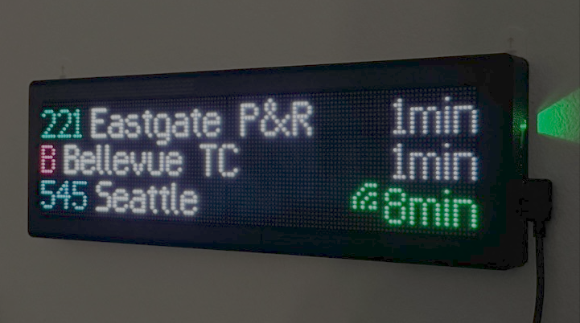
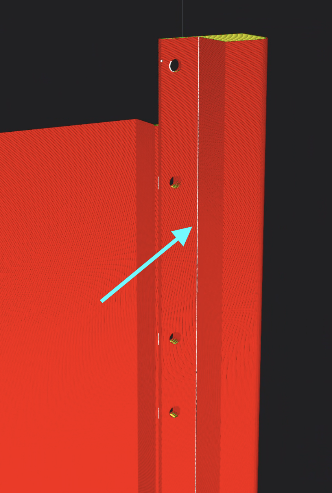

# DIY Transit Countdown Clock

This guide will walk you through building an ESP32-S3-based countdown clock which shows the real-time arrival times for any public transit route of your choice. By the end of this guide, you will have something that looks like this:

While we will be using this display as a countdown clock, you could customize it with your own firmware and display anything you'd like; however, that's out of scope for this guide.

- [Materials](#materials)
- [Instructions](#instructions)
  - [Part 1: Wire the displays](#part-1-wire-the-displays)
  - [Part 2: Flash the firmware](#part-2-flash-the-firmware)
  - [Part 3: 3D print the frame](#part-3-3d-print-the-frame)
    - [Recommendations](#recommendations)
      - [Material](#material)
      - [Orientation](#orientation)
      - [Slicer settings](#slicer-settings)
  - [Part 4: Assemble the frame](#part-4-assemble-the-frame)
  - [You're done!](#youre-done)

## Materials

- 1 × [Adafruit Matrix Portal S3](https://www.adafruit.com/product/5778)
- 2 × [Waveshare RGB-Matrix-P2.5-64x32](https://www.waveshare.com/rgb-matrix-p2.5-64x32.htm)
- 12 × M3x8mm machine bolts (you can get these at your local hardware store)
- 1 × USB power supply, at least 5V 3A
- 1 × USB-C cable, preferably right-angle

You will also need a 3D printer with a build volume of at least 30×115×210mm to print the frame. If you don't have one, you may be able to find one at your local library or university, or get the frame printed from a service online.

## Instructions

### Part 1: Wire the displays

First, remove the protective tape from the power terminal standoffs on the front of the Matrix Portal if you haven't already. Then, using the included screws, attach the power cable to the terminals. Make sure the red wire is connected to +5V and the black one is connected to GND.

TK photo here

Then connect the Matrix Portal to one of the displays using the 2x8 connector on the back of the display. Ensure you use the connector on the right side of the display when the arrows are pointing up.

Due to the plastic nub on the back of the display, the board may not sit flush with it. This is normal. Press it in as much as you can without forcing it.

TK photo here

Now we will connect the power cable to the displays. The included power cable is quite long for our purpose and will require some clever cable management.

Unwind the cable such that the two connectors are separate and untangled from each other.

TK photo here

Coil the cable so that it's short enough to reach the second display without too much slack. You may need to experiment with the length to get it just right. Then place the coiled cable inside the back of the frame so that it wraps around both the other 2x8 connector and the power connector.

TK photo here

Connect the power cable to both displays, bearing in mind the orientation of the cable. The red wires should be near the top, and the black wires should be near the bottom.

TK photo here

Finally, use the 2x8 IDC cable that came with one of the displays to connect one display to the other, making sure the arrows on both displays are pointing in the same direction.

TK photo here

Now that everything is wired together, you can plug the Matrix Portal board into a power supply and see the displays light up. The stock firmware flashed on Matrix Portal boards is for a single display, so don't worry if it looks wonky.

If the displays don't come to life:

- Make sure the screws on the Matrix Portal's power terminals are tight
- Ensure the power cable is connected to the correct terminals on the Matrix Portal (red to +5V, black to GND)
- Ensure the power cable is connected in the correct orientation to both displays

### Part 2: Flash the firmware

We will be using [ESPHome](https://esphome.io/) as the base for our display's firmware. ESPHome is a great platform with support for a wide range of devices and sensors, and it makes creating a custom ESP32-based device a very easy process. This means that you can extend the functionality of your countdown clock by adding more sensors in the future, as well as add it to home automation systems like Home Assistant.

TK how are we going to flash & configure this?

### Part 3: 3D print the frame

The frame for the display is designed to be 3D printed in two halves to accommodate the small build volume of most printers. Each half will fit one display and will be bolted together once assembled.

The halves are identical, so you only need to print the same file twice. In the root of this repository you will find `frame.stl`.

#### Recommendations

##### Material

There is no specific material recommendation; I have tested with PLA and it works splendidly. If you are planning on mounting the display somewhere other than indoors, you may want to consider a more UV- and weather-resistant material.

##### Orientation

To eliminate the need for supports, you should print the frame on its side as shown below:

##### Slicer settings

Layer height should be 0.2mm or less for good fit and finish.

To ensure dimensional accuracy where the displays are mounted, change your slicer's settings so that the z-seam is inside the frame as shown below.

In Cura, selecting "Sharpest Corner" for the "Z Seam Alignment" setting performs well.

You should optimize any other settings for accuracy around the inner corners near the front of the display. This area requires the tightest tolerances to ensure a snug fit for the displays. For example, you could decrease the wall print speed in this area to allow for better cooling and accuracy.

### Part 4: Assemble the frame

Once both halves are printed, we can place the displays and board assembly inside the frame.

We'll start with the primary display (the one with the board attached). With the board side on the right, slide the display into one half of the frame such that the display is flush with the front of the frame, and the board's USB-C port and buttons end up in the cutout on the side of it. If you encounter any resistance sliding the display in, you may need to slightly reposition the board.

If your cables have too much slack, it may pose a challenge to get the display to sit flush with the front of the frame. You may need to experiment with your cable management to get it just right.

TK video here

Once the display is in place, flip the frame over and secure it using the two outermost holes on the back of the frame (closest to the board) using M3x8mm bolts. We will secure the rest of the display later.

TK photo here

Then slide the second display into the other half of the frame in a similar fashion, and secure it as well.

TK photo here

Now you should align both halves of the frame so that the two holes near the center line up. Secure the halves of the frame together (and to the displays) using M3x8mm bolts.

TK photos here

Now you can fully secure the displays to the frame using the remaining holes.

You may need to make minor adjustments to the position of the displays to ensure they are flush with the front of the frame, and that the LEDs are aligned with each other. To make these adjustments, you can loosen the bolts slightly and hold the displays in place while tightening them back up. I recommend using slight pressure toward the top and center of the frame so that there is minimal gap between them and that they are vertically aligned.

Plug the board in to make sure everything still works. If it does, you're all set! If it doesn't, you may need to open the frame and inspect the connections again.

### You're done!

You can now mount your display anywhere you please. I personally mount mine to a wall using 3M Command strips, but you could also place it directly on a desk or other table.