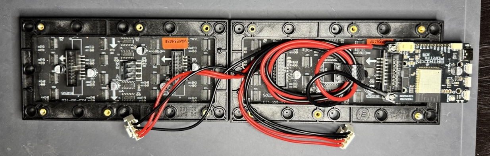
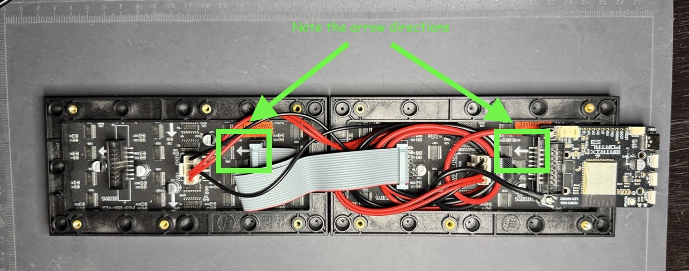

# Part 1: Connect Displays

Take out both LED matrix displays from their boxes. Inside the boxes there will also be a bag of various accessories and cables. From one of these bags, take out the power cable (black and red wires) and the 2x8 IDC cable (gray wires).

Remove the protective tape from the power terminal standoffs on the front of the Matrix Portal if you haven't already. Then, using the included screws, attach the power cable to the terminals. Make sure the red wire is connected to +5V and the black one is connected to GND.

Connect the Matrix Portal to one of the displays using the 2x8 connector on the back of the display.

Due to the plastic nub on the back of the display, the board may not sit flush with it. This is normal. Press it in as much as you can without forcing it.

Now we will connect the power cable to the displays. The included power cable is quite long for our purpose and will require some clever cable management. I recommend using a zip-tie or cable tie to keep everything nice and tidy.

Unwind the cable such that the two connectors are separate and untangled from each other.

Coil the cable so that it's short enough to reach the second display without too much slack. You may need to experiment with the length to get it just right. Then place the coiled cable inside the back of the frame so that it wraps around both the other 2x8 connector and the power connector.

Connect the power cable to both displays, bearing in mind the orientation of the cable. The black wires should be closer to "GND" and the red wires should be closer to "+5V".

Finally, use the 2x8 IDC cable that came with one of the displays to connect one display to the other, making sure the arrows on both displays are pointing in the same direction.

Now that everything is wired together, you can plug the Matrix Portal board into a power supply and see the displays light up. The stock firmware flashed on Matrix Portal boards is for a single display, so don't worry if it looks wonky.

If the displays don't come to life:

- Make sure the screws on the Matrix Portal's power terminals are tight
- Ensure the power cable is connected to the correct terminals on the Matrix Portal (red to +5V, black to GND)
- Ensure the power cable is connected in the correct orientation to both displays
