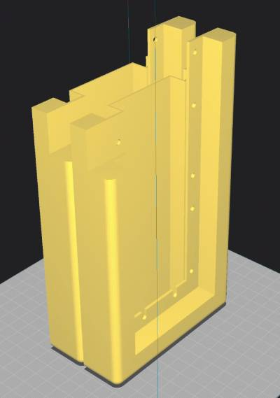
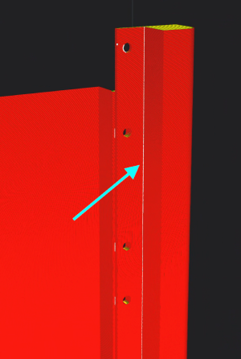

# Part 3: 3D Print Frame

The frame for the display is designed to be 3D printed in **two halves** to accommodate the small build volume of most printers. Each half will fit one display and will be screwed together once assembled. The halves are identical, so you only need to print the same file twice.

<iframe src="https://www.printables.com/embed/1332041" width="640" height="190" scrolling="no" frameborder="0"></iframe>

:::tip
If you're a fan of OpenSCAD and want to make modifications (e.g., for differently sized panels), you can try out [this version](https://github.com/BillKing94/transit-tracker-frame/blob/main/frame.scad) of the frame.
:::

## Recommendations

### Material

There is no specific material recommendation; I have tested with PLA and it works splendidly. If you are planning on mounting the display somewhere other than indoors, you may want to consider a more UV- and weather-resistant material. (And even then, it's not recommended to mount it outside since the electronics are not weather-resistant.)

### Orientation

To eliminate the need for supports, you should print the frame on its side as shown below:

If your printer is a "bed slinger" design, the long side should be parallel to the axis on which the bed moves. This will reduce the resonance as the bed moves back and forth, which can cause artifacts in the print, especially near the top of the print.

### Slicer settings

:::note
Your slicer may complain about the model not being water-tight or similar. This is normal due to how it was exported. You can manually inspect the generated G-code to ensure there are no issues.
:::

Since this is a larger print with few fine details, I recommend using a 0.6mm nozzle with your slicer's adaptive/variable layer height feature enabled. This will give you a reasonably short print time while still allowing finer details where needed, such as around the mounting holes.

To ensure dimensional accuracy where the displays are mounted, change your slicer's settings so that the z-seam is inside the frame as shown below.

- In Cura, selecting "Sharpest Corner" for the "Z Seam Alignment" setting performs well.
- PrusaSlicer does not require any changes to the default settings.

You should optimize any other settings for accuracy around the inner corners near the front of the display. This area requires the tightest tolerances to ensure a snug fit for the displays. For example, you could decrease the wall print speed in this area to allow for better cooling and accuracy.

You know your printer best and these settings are ultimately up to you, but here are some general considerations to help reduce failure:

- Make sure your build surface is clean.
- Use a textured PEI sheet or similar to help with bed adhesion.
- Use a brim.
- Print at a slower speed to reduce the chance of the print coming loose from the bed.
