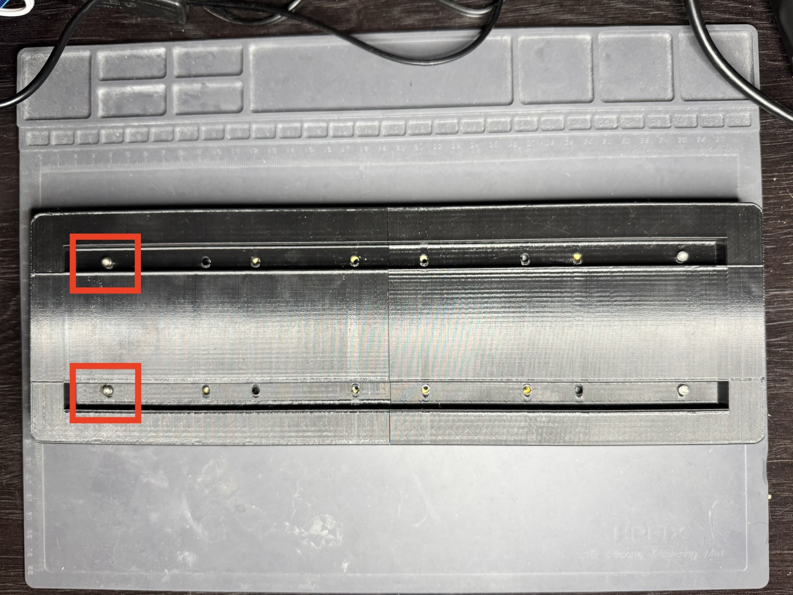
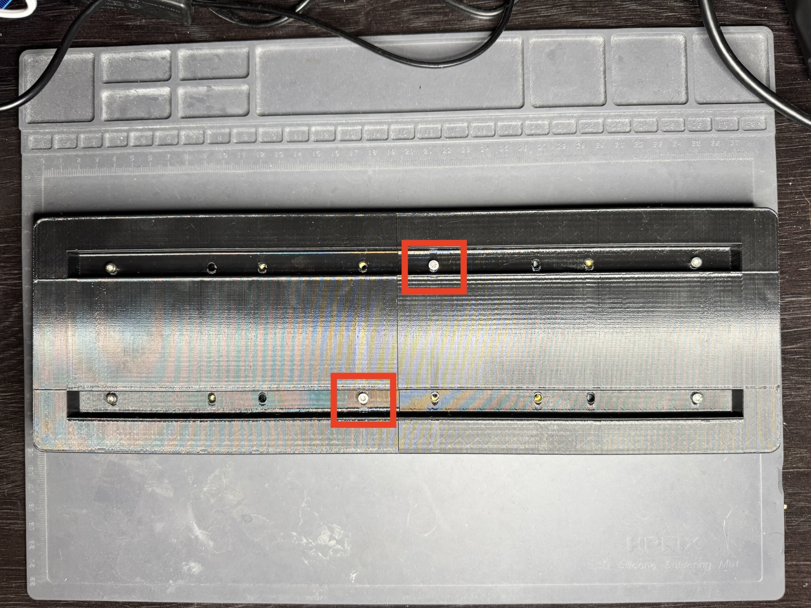

# Part 4: Assemble Frame

Once both halves are printed, we can place the displays and board assembly inside the frame.

We'll start with the primary display (the one with the board attached). With the board side on the right, slide the display into one half of the frame such that the display is flush with the front of the frame, and the board's USB-C port and buttons end up in the cutout on the side of it. If you encounter any resistance sliding the display in, you may need to slightly reposition the board.

If your cables have too much slack, it may pose a challenge to get the display to sit flush with the front of the frame. You may need to experiment with your cable management to get it just right.

import AssemblyVideo from "./_img/4-assembly.mp4"

  <video src={AssemblyVideo} controls style={{ maxWidth: "100%" }} />

Once the display is in place, flip the frame over and secure it using the two outermost holes on the back of the frame (closest to the board) using M3x8mm screws. We will secure the rest of the display later.

Then slide the second display into the other half of the frame in a similar fashion, and secure it as well.

Now you should align both halves of the frame so that the two holes near the center line up. Secure the halves of the frame together (and to the displays) using M3x8mm screws.

Now you can fully secure the displays to the frame using the remaining holes.

You may need to make minor adjustments to the position of the displays to ensure they are flush with the front of the frame, and that the LEDs are aligned with each other. To make these adjustments, you can loosen the screws slightly and hold the displays in place while tightening them back up. I recommend using slight pressure toward the top and center of the frame so that there is minimal gap between them and that they are vertically aligned.

Plug the board in to make sure everything still works. If it does, you're all set! If it doesn't, you may need to open the frame and inspect the connections again.
