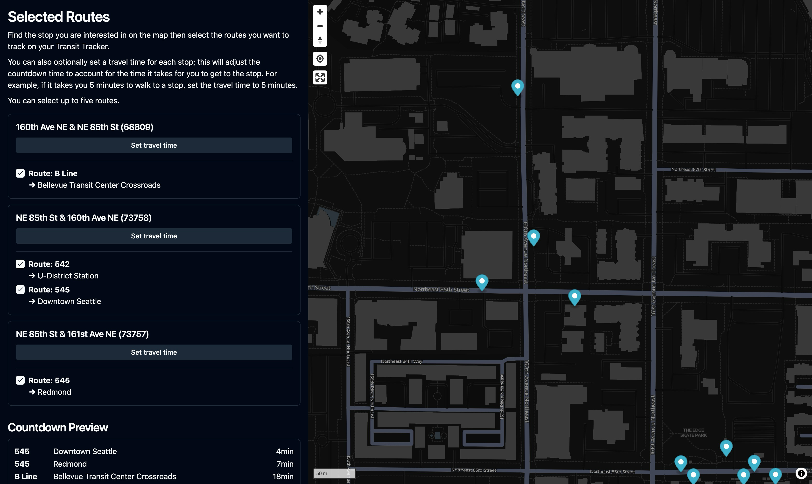

# Routes

## Selected Routes

This will show how many routes and stops have been selected.

Clicking the "Edit routes" button will open the route editor map.

### Route Editor

Find the a stop with departures or arrivals you want to track, click it, then select the routes you want to track. You can select up to five.

#### Travel Time

Under each selected stop is a "Set travel time" button. If you set one, it will be taken into account when displaying the countdown. For example, if you set a travel time of 5 minutes and a bus arrives in 15 minutes, the arrival time will be shown as 10 minutes.

This is useful because now only trips that you can feasibly make will be shown.

## Time Display

This option controls whether the displayed times count down to the next arrival or the next departure. It may be useful to choose departure if, for instance, your train or bus typically lingers at a station for a while before leaving.

## Time Units

You can change how the time units are displayed depending on how compact you want it to be.

| Option | Minutes Example | Hours and Minutes Example |
| :----- | :-------------- | :------------------------ |
| Long   | 15min           | 1h15m                     |
| Short  | 15m             | 1h15m                     |
| None   | 15              | 1:15                      |

## Schedule Mode

This option controls how the routes are displayed in the list. You can choose between two options:

- **Show trips from all routes sequentially**: This will show all trips from all routes in a single list, sorted by time. This is the default option.
- **Show only the next trip for each route**: This will show _only_ the next trip for each selected route. This is useful if one of your selected routes is much more frequent than others.