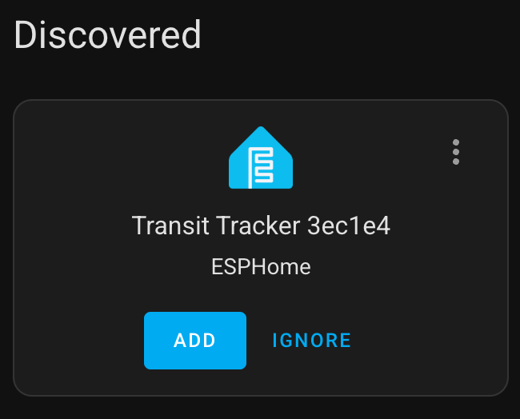

# Connecting to Home Assistant

You can connect your Transit Tracker to Home Assistant. Once the device is connected to your Wi-Fi network, Home Assistant should automatically prompt you to add it as an ESPHome integration in [Settings > Devices & services](https://my.home-assistant.io/redirect/integrations/):

If it's not automatically discovered, you can add an ESPHome integration manually:

Once added, the device exposes a light entity to control the display brightness and a button entity to restart the device. You can use these entities in your automations, for example, to turn down the display's brightness at night so you aren't blinded when you wake up.
