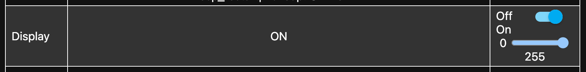

# How do I change the brightness?

## Buttons

You can use the buttons on the right side of your Transit Tracker to change the display brightness. The setting will be remembered when you power off the device.

import BrightnessControlsImage from "./_img/brightness-controls.png"


If you've flipped the display orientation, the buttons will be swapped accordingly.

## Web UI

You can change the brightness using the web UI. Visit your Transit Tracker's IP address in a web browser ([how?](./find-ip-address)) and use the "Display" control. The setting will be remembered when you power off the device.



## Web API

You can also change the brightness using the web API. Send a POST request to the following endpoint:

```
POST /light/display/turn_on?brightness=255
```

The brightness value can be between 0 and 255. The setting will be remembered when you power off the device.
